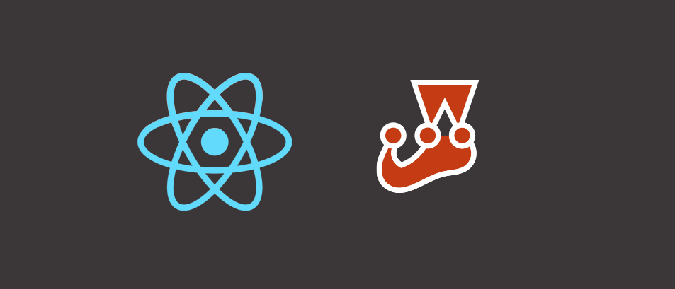

import {Appear, Notes} from 'mdx-deck'
import {CodeBlock} from './components/code-block'
import 'isomorphic-style-loader!css-loader!codemirror/lib/codemirror.css'
import 'isomorphic-style-loader!css-loader!./cm-night-owl.css'
import 'isomorphic-style-loader!css-loader!./styles.css'
import './script.js'

export {default as theme} from './theme'

# Testing the PADM with Jest

---

# What this talk is

- What Jest and Enzyme are
- How testing patterns can simplify development
- Why we don't need 100% coverage

---

# Thank You

[tech-talk.netlify.com](https://tech-talk.netlify.com)